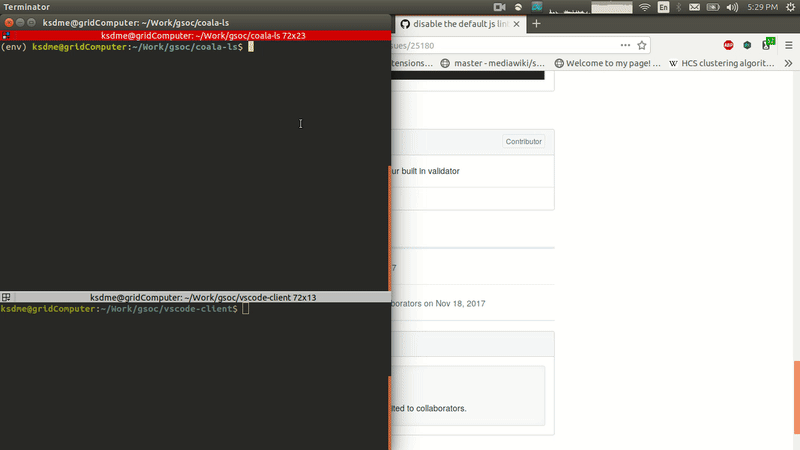

# coala-ls

A coala language server based on [Language Server Protocol (LSP)](https://github.com/Microsoft/language-server-protocol/blob/master/protocol.md).Python versions 3.x is supported.

## Feature preview

  
Watch full video on [YouTube](https://www.youtube.com/watch?v=MeybdlCB96U)

## Setting up your dev environment, coding, and debugging

You'll need python version 3.5 or greater, run `pip3 install -r requirements.txt` to install the requirements, and run `python3 -m coalals --mode=tcp --addr=2087` to start a local language server listening at port 2087. Currently `stdio` mode is also supported and can be used by invoking coalals with `--mode=stdio`.

## Reference

* [python-langserver](https://github.com/sourcegraph/python-langserver)
* [python-language-server](http://github.com/palantir/python-language-server)
