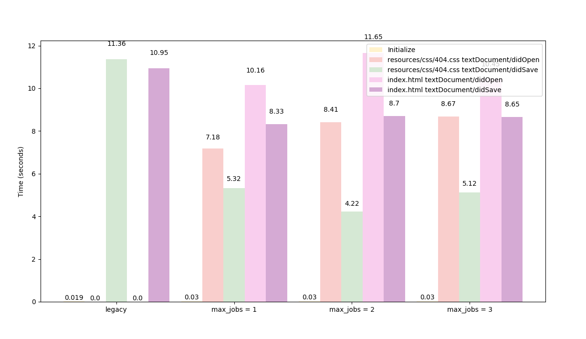

## Performance Metrics

Performance metrics of the coala-ls server. To maintain standard
comparison against some configuration at every phase of development
the codebase from https://github.com/ksdme/projects/tree/coalals-perf
is used to calculate the metrics. The .coafile configuration can be
found in the same repo.

Metrics are calculated on a per file basis since such said metrics
are heavily dependent on the source file and the coala configuration.
The number of concurrent jobs also affects the performance heavily,
metrics are also collected as per the number of jobs running. The
average time for the server to start up is `3.2 Sec`.

Response times for various requests in seconds sent to the server
with `max_jobs = 1`.

| request type                                 | time      | time (legacy) |
| -------------------------------------------- | --------- | ------------- |
| initialize                                   | 0.03 sec  | 0.019 sec     |
| `resources/css/404.css` textDocument/didOpen | 7.18 sec  |               |
| `resources/css/404.css` textDocument/didSave | 5.32 sec  | 11.36 sec     |
| `index.html` textDocument/didOpen            | 10.16 sec |               |
| `index.html` textDocument/didSave            | 8.33 sec  | 10.95 sec     |

Response time metrics in seconds with `max_jobs = 2`. coala-vs-code does
not support any other modes other than a default `max_jobs = 1` equivalent.

| job | request type                                 | time      |
| --- | -------------------------------------------- | --------- |
|     | initialize                                   | 0.03 sec  |
| J1  | `resources/css/404.css` textDocument/didOpen | 8.41 sec  |
| J1  | `index.html` textDocument/didOpen            | 11.65 sec |
| J2  | `resources/css/404.css` textDocument/didSave | 4.22 sec  |
| J2  | `index.html` textDocument/didSave            | 8.70 sec  |

Response time metrics in seconds with `max_jobs = 3`.

| job | request type                                        | time      |
| --- | --------------------------------------------------- | --------- |
|     | initialize                                          | 0.03 sec  |
| J1  | `resources/css/404.css` textDocument/didSave        | 5.15 sec  |
| J1  | `index.html` textDocument/didOpen                   | 10.45 sec |
| J2  | `resources/css/404.css` textDocument/didSave        | 5.12 sec  |
| J2  | `resources/css/style.css` textDocument/didSave      | 4.57 sec  |
| J2  | `index.html` textDocument/didSave                   | 8.65 sec  |

### Graphical Representation

